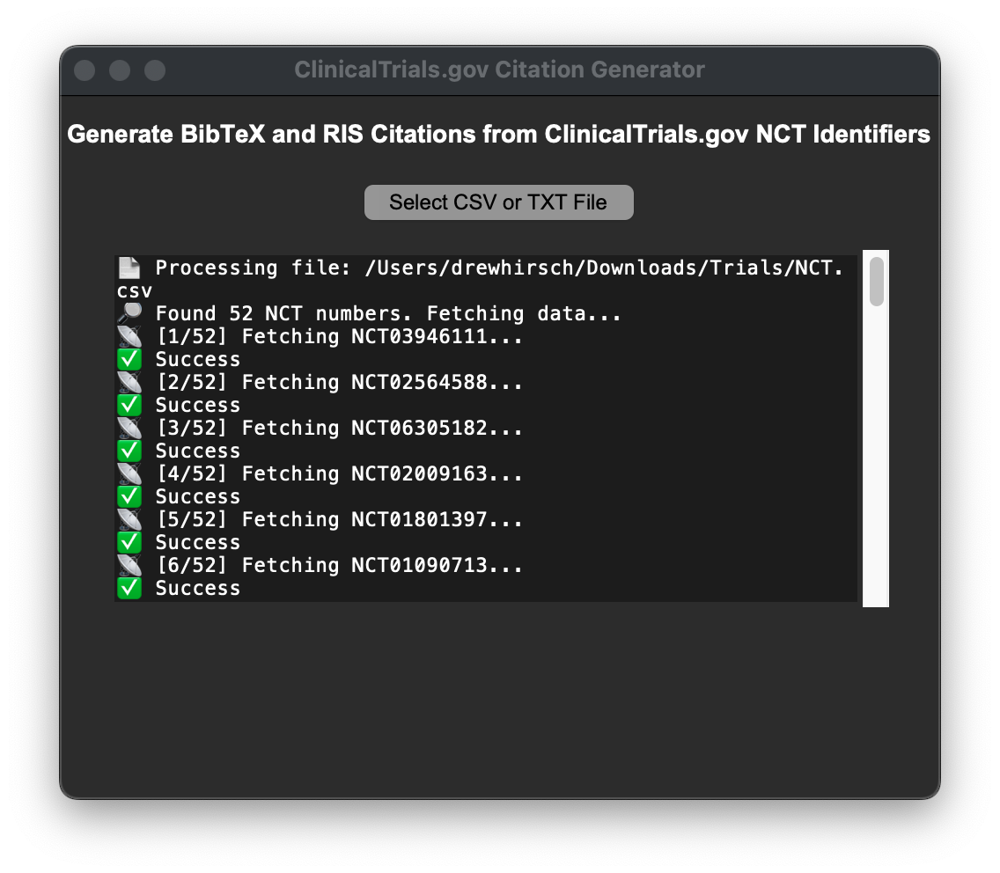

# ClinicalTrials.gov BibTeX and RIS Citation Generator

This repository contains a **graphical tool** for batch citing clinical trial records from ClinicalTrials.gov using NCT numbers. The tool **fetches metadata via the ClinicalTrials.gov REST API** and outputs citations in **BibTeX** and **RIS** formats for easy import into citation managers (i.e. Zotero). 


## Features
- **Uses the ClinicalTrials.gov REST API** to retrieve trial data
- **Graphical User Interface (GUI)** (No terminal required)
- **Supports CSV and TXT files** containing NCT numbers
- **Outputs formatted citations** in BibTeX (`citations.bib`) and RIS (`citations.ris`)
- **Displays real-time progress updates**

## Prepare Your Input File
Create a **TXT or CSV file** listing all ClinicalTrials.gov NCT identifier numbers (e.g., `NCT12345678`). Each NCT number should be on a separate line or in separate cells.


## How to Use
### Using the Mac Application
A macOS application **ClinicalTrialCiter.app** is available for ease of use.
- Open `ClinicalTrialCiter.app`
- Click "Select CSV/TXT File" and choose a .CSV or .TXT file with NCT numbers inside.
- The tool extracts valid NCT numbers and fetches trial data using the ClinicalTrials.gov REST API.
- Citations are saved as `citations.bib` and `citations.ris` in the same directory.


### Using the Python Script
If you prefer running the script manually, use the following command:
```bash
python gui_citations.py
```
- Click "Select CSV/TXT File" and choose a file with NCT numbers.
- The tool extracts valid NCT numbers and fetches trial data using the ClinicalTrials.gov REST API.
- Citations are saved as `citations.bib` and `citations.ris`.


## Citation Format

**Note:** The format and fields in RIS and BibTeX files do not always perfectly match all citation styles. Depending on the chosen style and author preferences, generated citations may not contain all necessary information.

**BibTeX Example:**
```bibtex
@article{NCT04052568,
  title = {Effects of Psilocybin in Anorexia Nervosa. ClinicalTrials.gov Identifier: NCT04052568},
  year = {2023},
  note = {Updated 2023-05-06. Retrieved 2025-03-02.},
  url = {https://clinicaltrials.gov/ct2/show/NCT04052568}
}
```

**RIS Example:**
```ris
TY  - JOUR
TI  - Effects of Psilocybin in Anorexia Nervosa. ClinicalTrials.gov Identifier: NCT04052568
DA  - 2023/05/06
UR  - https://clinicaltrials.gov/ct2/show/NCT04052568
PY  - 2023
RD  - 2025/03/02
ER  -
```

## Notes
- **Make sure your input file contains valid NCT numbers** (e.g., `NCT12345678`).
- **Ensure an internet connection** to fetch data via the ClinicalTrials.gov REST API.

